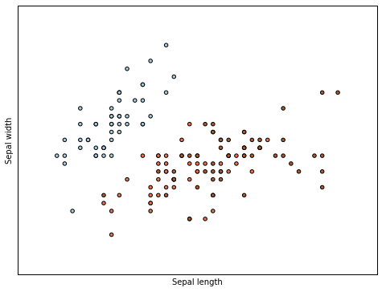
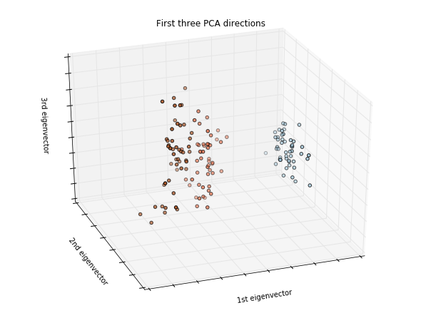

# Datasets

## 機器學習資料集/ 範例三: The iris dataset


http://scikit-learn.org/stable/auto_examples/datasets/plot_iris_dataset.html

這個範例目的是介紹機器學習範例資料集中的iris 鳶尾花資料集


## (一)引入函式庫及內建手寫數字資料庫


```python
#這行是在ipython notebook的介面裏專用，如果在其他介面則可以拿掉
%matplotlib inline

import matplotlib.pyplot as plt
from mpl_toolkits.mplot3d import Axes3D
from sklearn import datasets
from sklearn.decomposition import PCA

# import some data to play with
iris = datasets.load_iris()
X = iris.data[:, :2]  # we only take the first two features.
Y = iris.target

x_min, x_max = X[:, 0].min() - .5, X[:, 0].max() + .5
y_min, y_max = X[:, 1].min() - .5, X[:, 1].max() + .5

plt.figure(2, figsize=(8, 6))
plt.clf()
# Plot the training points
plt.scatter(X[:, 0], X[:, 1], c=Y, cmap=plt.cm.Paired)
plt.xlabel('Sepal length')
plt.ylabel('Sepal width')

plt.xlim(x_min, x_max)
plt.ylim(y_min, y_max)
plt.xticks(())
plt.yticks(())

```




## (二)資料集介紹
`iris = datasets.load_iris()` 將一個dict型別資料存入iris，我們可以用下面程式碼來觀察裏面資料


```python
for key,value in iris.items() :
    try:
        print (key,value.shape)
    except:
        print (key)
print(iris['feature_names'])
```

| 顯示 | 說明 |
| -- | -- |
| ('target_names', (3L,))| 共有三種鳶尾花 setosa, versicolor, virginica |
| ('data', (150L, 4L)) | 有150筆資料，共四種特徵 |
| ('target', (150L,))| 這150筆資料各是那一種鳶尾花|
| DESCR | 資料之描述 |
| feature_names| 四個特徵代表的意義，分別為 萼片(sepal)之長與寬以及花瓣(petal)之長與寬

為了用視覺化方式呈現這個資料集，下面程式碼首先使用PCA演算法將資料維度降低至3


```python
X_reduced = PCA(n_components=3).fit_transform(iris.data)
```

接下來將三個維度的資料立用`mpl_toolkits.mplot3d.Axes3D` 建立三維繪圖空間，並利用 `scatter`以三個特徵資料數值當成座標繪入空間，並以三種iris之數值 Y，來指定資料點的顏色。我們可以看出三種iris中，有一種明顯的可以與其他兩種區別，而另外兩種則無法明顯區別。


```python
# To getter a better understanding of interaction of the dimensions
# plot the first three PCA dimensions
fig = plt.figure(1, figsize=(8, 6))
ax = Axes3D(fig, elev=-150, azim=110)
ax.scatter(X_reduced[:, 0], X_reduced[:, 1], X_reduced[:, 2], c=Y,
           cmap=plt.cm.Paired)
ax.set_title("First three PCA directions")
ax.set_xlabel("1st eigenvector")
ax.w_xaxis.set_ticklabels([])
ax.set_ylabel("2nd eigenvector")
ax.w_yaxis.set_ticklabels([])
ax.set_zlabel("3rd eigenvector")
ax.w_zaxis.set_ticklabels([])

plt.show()
```





```python
#接著我們嘗試將這個機器學習資料之描述檔顯示出來
print(iris['DESCR'])
```

    Iris Plants Database

    Notes
    -----
    Data Set Characteristics:
        :Number of Instances: 150 (50 in each of three classes)
        :Number of Attributes: 4 numeric, predictive attributes and the class
        :Attribute Information:
            - sepal length in cm
            - sepal width in cm
            - petal length in cm
            - petal width in cm
            - class:
                    - Iris-Setosa
                    - Iris-Versicolour
                    - Iris-Virginica
        :Summary Statistics:

        ============== ==== ==== ======= ===== ====================
                        Min  Max   Mean    SD   Class Correlation
        ============== ==== ==== ======= ===== ====================
        sepal length:   4.3  7.9   5.84   0.83    0.7826
        sepal width:    2.0  4.4   3.05   0.43   -0.4194
        petal length:   1.0  6.9   3.76   1.76    0.9490  (high!)
        petal width:    0.1  2.5   1.20  0.76     0.9565  (high!)
        ============== ==== ==== ======= ===== ====================

        :Missing Attribute Values: None
        :Class Distribution: 33.3% for each of 3 classes.
        :Creator: R.A. Fisher
        :Donor: Michael Marshall (MARSHALL%PLU@io.arc.nasa.gov)
        :Date: July, 1988

    This is a copy of UCI ML iris datasets.
    http://archive.ics.uci.edu/ml/datasets/Iris

    The famous Iris database, first used by Sir R.A Fisher

    This is perhaps the best known database to be found in the
    pattern recognition literature.  Fisher's paper is a classic in the field and
    is referenced frequently to this day.  (See Duda & Hart, for example.)  The
    data set contains 3 classes of 50 instances each, where each class refers to a
    type of iris plant.  One class is linearly separable from the other 2; the
    latter are NOT linearly separable from each other.

    References
    ----------
       - Fisher,R.A. "The use of multiple measurements in taxonomic problems"
         Annual Eugenics, 7, Part II, 179-188 (1936); also in "Contributions to
         Mathematical Statistics" (John Wiley, NY, 1950).
       - Duda,R.O., & Hart,P.E. (1973) Pattern Classification and Scene Analysis.
         (Q327.D83) John Wiley & Sons.  ISBN 0-471-22361-1.  See page 218.
       - Dasarathy, B.V. (1980) "Nosing Around the Neighborhood: A New System
         Structure and Classification Rule for Recognition in Partially Exposed
         Environments".  IEEE Transactions on Pattern Analysis and Machine
         Intelligence, Vol. PAMI-2, No. 1, 67-71.
       - Gates, G.W. (1972) "The Reduced Nearest Neighbor Rule".  IEEE Transactions
         on Information Theory, May 1972, 431-433.
       - See also: 1988 MLC Proceedings, 54-64.  Cheeseman et al"s AUTOCLASS II
         conceptual clustering system finds 3 classes in the data.
       - Many, many more ...


這個描述檔說明了這個資料集是在 1936年時由Fisher建立，為圖形識別領域之重要經典範例。共例用四種特徵來分類三種鳶尾花

## (三)應用範例介紹
在整個scikit-learn應用範例中，有以下幾個範例是利用了這組iris資料集。

* 分類法 Classification
   * [EX 3: Plot classification probability](../Classification/ex3_Plot_classification_probability.md)
* 特徵選擇 Feature Selection
   * [Ex 5: Test with permutations the significance of a classification score](../Feature_Selection/ex5_test_with_permutations_the_significance_of_a__.md)
   * [Ex 6: Univariate Feature Selection](../Feature_Selection/ex6_univariate_feature_selection.md)
* 通用範例 General Examples
   * [Ex 2: Concatenating multiple feature extraction methods](../general_examples/Ex2_feature_stacker.md)
