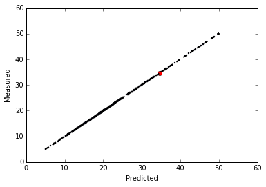

##支持向量機回歸分析: Property value prediction

此檔案使用scikit-learn 機器學習套件裡的SVR演算法，來達成波士頓房地產價錢預測


## (一)引入函式庫及內建波士頓房地產資料庫

引入之函式庫如下

1. `sklearn.datasets`: 用來匯入內建之波士頓房地產資料庫
2. `sklearn.SVR`: 支持向量機回歸分析之演算法
3. `matplotlib.pyplot`: 用來繪製影像

```python
from sklearn import datasets
from sklearn.svm import SVR
import matplotlib.pyplot as plt

boston = datasets.load_boston()
X=boston.data
y = boston.target
```

使用 `datasets.load_boston()` 將資料存入至`boston`。
使用`datasets.data`將士頓房地產資料的數據資料(data)匯入到`X`。
使用`datasets.target`將士頓房地產資料的預測數值匯入到`y`。
為一個dict型別資料，我們看一下資料的內容。


## (二)`SVR`的使用

`sklearn.svm.SVR`(kernel='rbf', degree=3, gamma='auto', coef0=0.0, tol=0.001, C=1.0, epsilon=0.1, shrinking=True, cache_size=200, verbose=False, max_iter=-1)

```python
clf = SVR(kernel='rbf', C=1e3, gamma=0.1)
clf.fit(X, y)
```
使用`clf = SVR(kernel='rbf', C=1e3, gamma=0.1)`，將SVR演算法引入到clf，並設定SVR演算法的參數。
使用`clf.fit(X, y)`，用波士頓房地產數據(boston.data)以及預測目標(y)來訓練預測機clf

## (三)使用`joblib.dump`匯出預測器

```python
from sklearn.externals import joblib
joblib.dump(clf,"./machine_SVR.pkl")
```
使用`joblib.dump`將SVR預測器匯出為pkl檔。


##(四)訓練以及分類
接著使用`clf=joblib.load("./machine_SVR.pkl")`將pkl檔匯入為一個SVR預測器`clf`。接著使用波士頓房地產數據(boston.data)，以及預測目標(y)來訓練預測機clf `clf.fit(boston.data, y)`。最後，使用`predict_y=clf.predict(boston.data[2])`預測第三筆資料的價格，並將結果存入`predicted_y`變數。

```python
clf=joblib.load("./machine_SVR.pkl")
clf.fit(boston.data, y)
predict_y=clf.predict(boston.data[2])
```


##(五)使用`score`計算準確率
先用`predict=clf.predict(X)`將所有波士頓房地產數據丟入clf預測機預測，並將所預測出的結果存入`predict`。接著使用`clf.score(X, y)`來計算準確率，score=1為最理想情況，本範例中`score`=0.99988275378631286

```python
predict=clf.predict(X)
clf.score(X, y)
```


## (六)繪出預測結果與實際目標差異圖
X軸為預測結果，Y軸為回歸目標。
並劃出一條斜率=1的理想曲線(用虛線標示)。
紅點為房地產第三項數據的預測結果

因為使用clf的準確率很高，所以預測結果與回歸目標幾乎一樣，scatter的點會幾乎都在理想曲線上。

```python
plt.scatter(predict,y,s=2)
plt.plot(predict_y, predict_y, 'ro')
plt.plot([y.min(), y.max()], [y.min(), y.max()], 'k--', lw=2)
plt.xlabel('Predicted')
plt.ylabel('Measured')
```



## (六)完整程式碼

```python
%matplotlib inline
from sklearn import datasets
from sklearn.svm import SVR
import matplotlib.pyplot as plt

boston = datasets.load_boston()
X=boston.data
y = boston.target
clf = SVR(kernel='rbf', C=1e3, gamma=0.1)
clf.fit(X, y)
from sklearn.externals import joblib
joblib.dump(clf,"./machine_SVR.pkl")
clf=joblib.load("./machine_SVR.pkl")
clf.fit(boston.data, y)
predict_y=clf.predict(boston.data[2])
predict=clf.predict(X)
clf.score(X, y)
plt.scatter(predict,y,s=2)
plt.plot(predict_y, predict_y, 'ro')
plt.plot([y.min(), y.max()], [y.min(), y.max()], 'k--', lw=2)
plt.xlabel('Predicted')
plt.ylabel('Measured')
```
