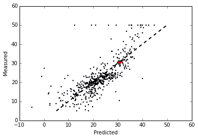

##線性回歸分析: Property value prediction

此檔案使用scikit-learn 機器學習套件裡的linear regression演算法，來達成波士頓房地產價錢預測

1. 資料集：波士頓房產
2. 特徵：房地產客觀數據，如年份、平面大小
3. 預測目標：房地產價格
4. 機器學習方法：線性迴歸
5. 探討重點：10 等分的交叉驗証(10-fold Cross-Validation)來實際測試資料以及預測值的關係
6. 關鍵函式： `sklearn.cross_validation.cross_val_predict`；`joblib.dump`；`joblib.load`


## (一)引入函式庫及內建波士頓房地產資料庫

引入之函式庫如下

1. `sklearn.datasets`: 用來匯入內建之波士頓房地產資料庫
2. `sklearn.cross_val_predict`: 使用交叉驗證用來評估辨識準確度
3. `sklearn.linear_model`: 線性分析之模組
4. `matplotlib.pyplot`: 用來繪製影像 

```python
from sklearn import datasets
from sklearn.cross_validation import cross_val_predict
from sklearn import linear_model
import matplotlib.pyplot as plt

lr = linear_model.LinearRegression()
# The boston dataset
boston = datasets.load_boston()
y = boston.target
```

使用`linear_model.LinearRegression()`將線性迴歸分析演算法引入到`lr`。
使用`datasets.target`將士頓房地產資料的預測數值匯入到`y`。
使用 `datasets.load_boston()` 將資料存入， `boston` 為一個dict型別資料，我們看一下資料的內容。

| 顯示 | 說明 |
| -- | -- |
| ('data', (506, 13))| 房地產的資料集，共506筆房產13個特徵 |
| ('feature_names', (13,)) | 房地產的特徵名 |
| ('target', (506,)) | 回歸目標 |
| DESCR | 資料之描述 |


## (二)`cross_val_predict`的使用

`sklearn.cross_validation.cross_val_predict`(estimator, X, y=None, cv=None, n_jobs=1, verbose=0, fit_params=None, pre_dispatch='2*n_jobs')

X為機器學習數據，
y為回歸目標，
cv為交叉驗証時資料切分的依據，範例為10則將資料切分為10等分，以其中9等分為訓練集，另外一等分則為測試集。
```python
predicted = cross_val_predict(lr, boston.data, y, cv=10)
```


## (三)使用`joblib.dump`匯出預測器

```python
from sklearn.externals import joblib

joblib.dump(lr,"./lr_machine.pkl")
```
使用`joblib.dump`將線性回歸預測器匯出為pkl檔。


##(四)訓練以及分類
接著使用`lr=joblib.load("./lr_machine.pkl")`將pkl檔匯入為一個linear regression預測器`lr`。接著使用波士頓房地產數據(boston.data)，以及預測目標(y)來訓練預測機lr `lr.fit(boston.data, y)`。最後，使用`predict_y=lr.predict(boston.data[2])`預測第三筆資料的價格，並將結果存入`predicted_y`變數。

```python
lr=joblib.load("./lr_machine.pkl")
lr.fit(boston.data, y)
predict_y=lr.predict(boston.data[2])
```


## (五)繪出預測結果與實際目標差異圖
X軸為預測結果，Y軸為回歸目標。
並劃出一條斜率=1的理想曲線(用虛線標示)。

紅點為房地產第三項數據的預測結果。

```python
plt.scatter(predicted,y,s=2)
plt.plot(predict_y, predict_y, 'ro')
plt.plot([y.min(), y.max()], [y.min(), y.max()], 'k--', lw=2)
plt.xlabel('Predicted')
plt.ylabel('Measured')
```



## (六)完整程式碼

```python
%matplotlib inline
from sklearn import datasets
from sklearn.cross_validation import cross_val_predict
from sklearn import linear_model
import matplotlib.pyplot as plt

lr = linear_model.LinearRegression()
boston = datasets.load_boston()
y = boston.target
# cross_val_predict returns an array of the same size as `y` where each entry
# is a prediction obtained by cross validated:
predicted = cross_val_predict(lr, boston.data, y, cv=10)
from sklearn.externals import joblib

joblib.dump(lr,"./lr_machine.pkl")
lr=joblib.load("./lr_machine.pkl")
lr.fit(boston.data, y)
predict_y=lr.predict(boston.data[2])
plt.scatter(predicted,y,s=2)
plt.plot(predict_y, predict_y, 'ro')
plt.plot([y.min(), y.max()], [y.min(), y.max()], 'k--', lw=2)
plt.xlabel('Predicted')
plt.ylabel('Measured')
```
