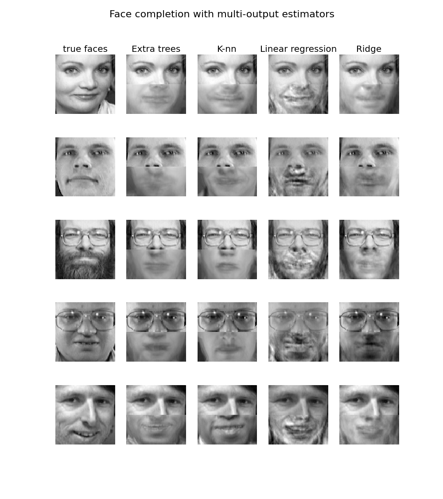

##通用範例/範例七: Face completion with a multi-output estimators

http://scikit-learn.org/stable/auto_examples/plot_multioutput_face_completion.html

這個範例用來展示scikit-learn如何用 `extremely randomized trees`, `k nearest neighbors`, `linear regression` 和 `ridge regression` 演算法來完成人臉估測。


## (一)引入函式庫及內建影像資料庫

引入之函式庫如下

1. `sklearn.datasets`: 用來繪入內建之影像資料庫
2. `sklearn.utils.validation`: 用來取亂數
3. `sklearn.ensemble`
4. `sklearn.neighbors`
5. `sklearn.linear_model`

使用 `datasets.load_digits()` 將資料存入， `data` 為一個dict型別資料，我們看一下資料的內容。

```python
from sklearn.datasets import fetch_olivetti_faces
data = fetch_olivetti_faces()
targets = data.target
data = data.images.reshape((len(data.images), -1))
```

| 顯示 | 說明 |
| -- | -- |
| ('images', (400, 64, 64))| 共有40個人，每個人各有10張影像，共有 400 張影像，影像大小為 64x64 |
| ('data', (400, 4096)) | data 則是將64x64的矩陣攤平成4096個元素之一維向量 |
| ('targets', (400,)) | 說明400張圖與40個人之分類對應 0-39，記錄每張影像是哪一個人 |
| DESCR | 資料之描述 |


前面30個人當訓練資料，之後當測試資料
```python
train = data[targets < 30]
test = data[targets >= 30]
```
測試影像從100張亂數選5張出來，變數`test`的大小變成(5,4096)
```python
# Test on a subset of people
n_faces = 5
rng = check_random_state(4)
face_ids = rng.randint(test.shape[0], size=(n_faces, ))
test = test[face_ids, :]
```

把每張訓練影像和測試影像都切割成上下兩部分:

X_人臉上半部分，
Y_人臉下半部分。
```python
n_pixels = data.shape[1]
X_train = train[:, :np.ceil(0.5 * n_pixels)]  
y_train = train[:, np.floor(0.5 * n_pixels):]  
X_test = test[:, :np.ceil(0.5 * n_pixels)]
y_test = test[:, np.floor(0.5 * n_pixels):]
```

## (二)資料訓練
分別用以下四種演算法來完成人臉下半部估測

1. `extremely randomized trees` (絕對隨機森林演算法)
2. `k nearest neighbors` (K-鄰近演算法)
3. `linear regression` (線性回歸演算法)
4. `ridge regression` (脊回歸演算法)


```python
ESTIMATORS = {
    "Extra trees": ExtraTreesRegressor(n_estimators=10, max_features=32,random_state=0),
    "K-nn": KNeighborsRegressor(),
    "Linear regression": LinearRegression(),
    "Ridge": RidgeCV(),
}
```

分別把訓練資料人臉上、下部分放入`estimator.fit()`中進行訓練。上半部分人臉為條件影像，下半部人臉為目標影像。

`y_test_predict`為一個dict型別資料，存放5位測試者分別用四種演算法得到的人臉下半部估計結果。

```python
y_test_predict = dict()
for name, estimator in ESTIMATORS.items():
    estimator.fit(X_train, y_train)
    y_test_predict[name] = estimator.predict(X_test)
```

## (三)`matplotlib.pyplot`畫出結果

每張影像都是64*64，總共有5位測試者，每位測試者分別有1張原圖，加上使用4種演算法得到的估測結果。

```python
image_shape = (64, 64)
n_cols = 1 + len(ESTIMATORS)
plt.figure(figsize=(2. * n_cols, 2.26 * n_faces))
plt.suptitle("Face completion with multi-output estimators", size=16)

for i in range(n_faces):
    true_face = np.hstack((X_test[i], y_test[i]))

    if i:
        sub = plt.subplot(n_faces, n_cols, i * n_cols + 1)
    else:
        sub = plt.subplot(n_faces, n_cols, i * n_cols + 1,
                          title="true faces")


    sub.axis("off")
    sub.imshow(true_face.reshape(image_shape),
               cmap=plt.cm.gray,
               interpolation="nearest")

    for j, est in enumerate(sorted(ESTIMATORS)):
        completed_face = np.hstack((X_test[i], y_test_predict[est][i]))

        if i:
            sub = plt.subplot(n_faces, n_cols, i * n_cols + 2 + j)

        else:
            sub = plt.subplot(n_faces, n_cols, i * n_cols + 2 + j,
                              title=est)

        sub.axis("off")
        sub.imshow(completed_face.reshape(image_shape),
                   cmap=plt.cm.gray,
                   interpolation="nearest")

plt.show()
```


